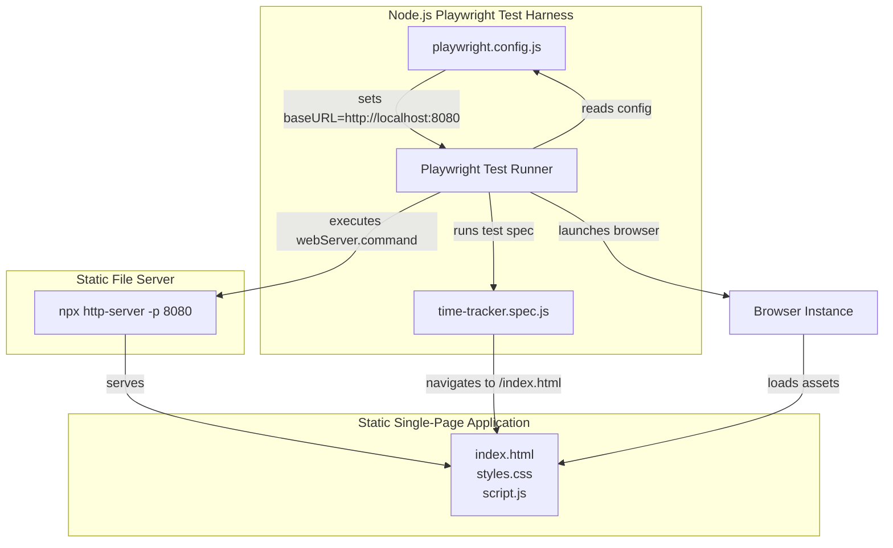
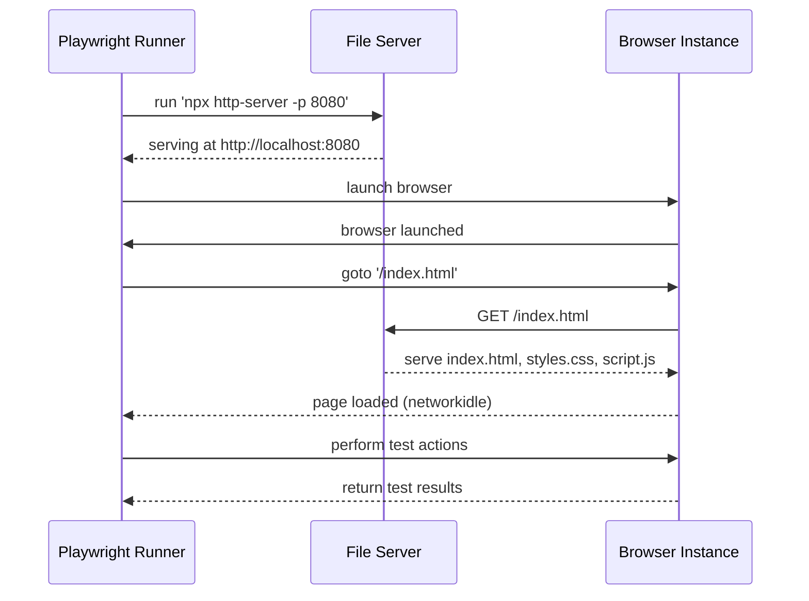

# System Architecture & Runtime Model Feature Documentation

## Overview

The Time Tracker application is a minimal static single-page web app that runs entirely in the browser, allowing users to record and view days worked per week for the current month. All application state is held in-memory within the client, with no backend or API boundary, making it extremely lightweight and easy to host on any static file server.

A complementary Node.js Playwright test harness provides end-to-end validation by launching a local static file server, driving real browsers (Chromium, Firefox, WebKit, and mobile emulations), and verifying UI behavior against `index.html`. Tests run both locally and in GitHub Actions CI, producing HTML reports and artifacts.

## 1.1 Application Topology (Static SPA + Test Harness)

### Architecture Diagram

### Component Structure

#### 1. Static Single-Page Application

- **index.html** (`/index.html`)

Entry point that defines the markup, loads styles and script .

- **styles.css** (`/styles.css`)

CSS definitions for layout, typography, and success animations .

- **script.js** (`/script.js`)

Application logic: month navigation, week-card generation, in-memory storage, input validation, DOM updates, and total calculation .

#### 2. Playwright Test Harness

- **playwright.config.js**

Defines test projects (Chromium, Firefox, WebKit, Pixel 5, iPhone 12), reporters, retries, `use.baseURL: 'http://localhost:8080'`, and a `webServer` block that runs

`command: 'npx http-server -p 8080'` before tests .

- **time-tracker.spec.js**

Test suite driving the browser to `http://localhost:8080/index.html`, awaiting `networkidle`, and asserting UI elements and interactions .

- **package.json**

NPM scripts for running the server (`npm run server` → `http-server -p 8080`) and executing tests (`npm test` → `playwright test`) .

### Runtime Model & Interactions

The runtime model comprises two main processes:

1. **Static SPA in Browser**- Served by a lightweight Node.js HTTP server (`http-server -p 8080`).
- All UI logic, state management (per-month week data), and rendering run client-side in JavaScript.

1. **Playwright Test Runner (Node.js)**- Reads `playwright.config.js` to configure browsers and the local `webServer` command.
- Launches the HTTP server, then parallel test projects.
- For each test: opens a real browser instance, navigates to `/index.html`, waits for `networkidle`, and performs user interactions (filling inputs, clicking Save, navigating months).
- Captures screenshots, videos, and traces on failures; outputs HTML and list reports.

## Key Components Reference

| Component | Location | Responsibility |
| --- | --- | --- |
| index.html | `/index.html` | Defines UI structure and includes assets |
| styles.css | `/styles.css` | Styling and animations |
| script.js | `/script.js` | Client-side logic and state management |
| playwright.config.js | `/playwright.config.js` | Configuration for browsers and webServer setup |
| time-tracker.spec.js | `/time-tracker.spec.js` | End-to-end test definitions |
| package.json | `/package.json` | NPM scripts and dependencies |
