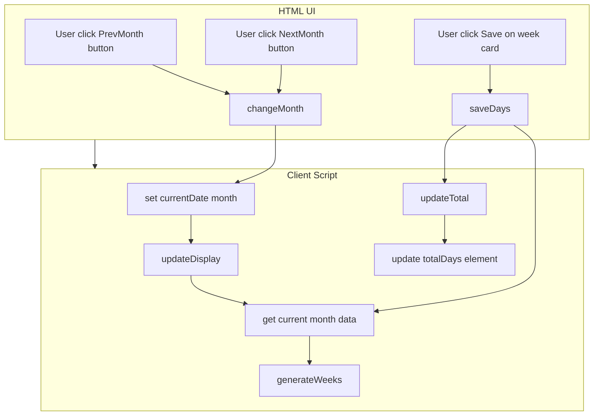
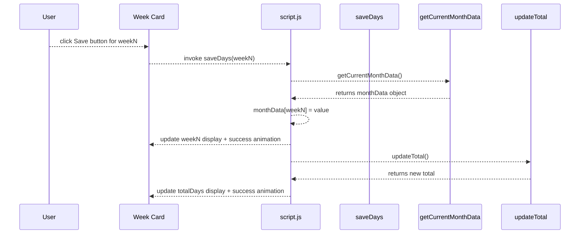
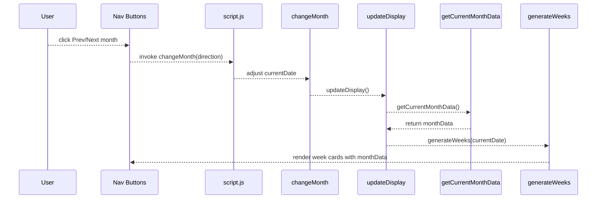

# System Architecture & Runtime Model

## 1.2 State Management and Month Scoping (timeData.months)

### Overview

The Time Tracker SPA maintains all user‐entered data in a simple in-memory JavaScript object named `timeData`. This object contains a `months` property that maps month keys (formatted as `"YYYY-MM"`) to per-month data objects of week entries. No data persists beyond the browser session—reloading the page clears all entries.

When the user navigates between months via the “Prev”/“Next” buttons, the application updates a global `currentDate`, computes a new month key via `getMonthKey`, and switches context to the corresponding `timeData.months[monthKey]` object. If no data exists for that month, an empty record is initialized. Navigating back to a previously visited month restores the original entries, ensuring isolation between months and preservation within the same session.

### Architecture Overview

### Component Structure

#### index.html (`index.html`)

- **Purpose and responsibilities**

Renders the static structure: header, month selector, summary card, and container for week cards.

- **Key elements**- `#prevMonth` / `#nextMonth`: Month navigation buttons
- `#currentMonth`: Badge displaying the active month name
- `#totalDays`: Total days counter for the active month
- `#weeksContainer`: Placeholder for dynamic week cards

#### script.js (`script.js`)

- **Purpose**

Implements client‐side logic for data storage, month navigation, week card generation, day entry, validation, and total calculation.

- **Key Variables**- `timeData.months`: Object mapping `"YYYY-MM"` → `{ week1: number, week2: number, … }`
- `currentDate`: JavaScript `Date` object representing the active month
- **Key Functions**- `getMonthKey(date)`: Returns `"YYYY-MM"` for any `Date` instance
- `getCurrentMonthData()`: Ensures `timeData.months[monthKey]` exists and returns it
- `changeMonth(direction)`: Shifts `currentDate` by `direction` months and calls `updateDisplay()`
- `generateWeeks(date)`: Creates week cards for the specified month, populating each with saved data
- `saveDays(weekId)`: Validates user input (0–7), writes to the current month’s data object, triggers a success animation, and updates the total
- `updateTotal()`: Sums all week entries in the current month and updates `#totalDays` with animation

### Data Models

#### timeData

| Property | Type | Description |
| --- | --- | --- |
| months | Record<string, Record<string, number>> | In-memory session storage. Keys are month strings `"YYYY-MM"`. Each value is a map of `"weekN"` → days worked |

### Feature Flows

#### Saving Days Flow

#### Month Navigation Flow

### State Management

- **Lifecycle**: All data lives solely in the browser’s memory for the lifetime of the page.
- **Scoping**: The `months` record in `timeData` keys data by `"YYYY-MM"` via `getMonthKey(date)` .
- **Initialization**: On first access to a new month, `getCurrentMonthData()` injects an empty object at `timeData.months[monthKey]` .
- **Isolation & Preservation**: Each month’s entries are siloed under its key. Switching to a different `currentDate` yields a different data object. Returning to a month restores previously entered week values, as verified by end-to-end tests .

### Error Handling

- **Input Validation**: `saveDays` checks that entered days are between 0 and 7 inclusive. On violation, it shows an `alert` with the message  and aborts saving .

### Caching Strategy

- **In-Memory Cache**: The `timeData.months` object serves as a simple session cache.
- **Cache Keys**: Month keys follow the `"YYYY-MM"` convention.
- **Invalidation Rules**: No automatic invalidation—data persists until the page is reloaded or closed.

### Testing Considerations

- **Month-to-Month Isolation**: Tests confirm that data entered in one month does not appear when navigating to another, and that returning restores the original data .
- **State Retention**: Navigation tests verify that creating new month data starts at zero and that revisiting retains prior entries.
- **Boundary Validation**: Entering values outside 0–7 triggers dialog and prevents data corruption.

### Key Functions Reference

| Function | Responsibility |
| --- | --- |
| `getMonthKey` | Generate unique month key from a `Date` object |
| `getCurrentMonthData` | Initialize (if needed) and retrieve data object for the active month |
| `changeMonth` | Shift `currentDate` by given offset and refresh the display |
| `saveDays` | Validate input, write to month data, animate update, recalc total |
| `updateTotal` | Sum all week entries for active month and update the UI |
