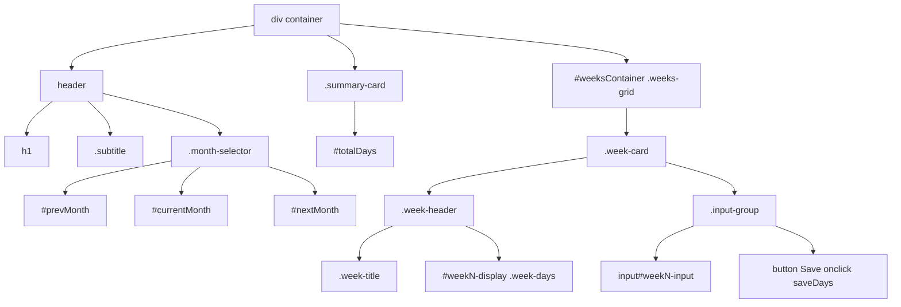

## 2) Time Tracker Web App (UI + Client Logic)

### 2.1 UI Structure & DOM Contract

This subsection defines the exact IDs and class names in `index.html`, the conventions used by `script.js` to generate dynamic content, and the selectors relied on by Playwright tests in `time-tracker.spec.js`. Keeping this “DOM contract” stable ensures that UI logic and end-to-end tests continue to function as expected.

#### Static Elements

These elements are present in the initial HTML payload and are referenced directly by the client logic and tests:

| Selector | Element Type | Description |
| --- | --- | --- |
| h1 | Heading | Main title “Time Tracker” shown at top of page |
| .subtitle | Paragraph | Subtitle text “Track your work days this month” |
| #prevMonth | Button | “Previous month” navigation button, calls `changeMonth(-1)` on click |
| #currentMonth | Div | Badge displaying current month name and year |
| #nextMonth | Button | “Next month” navigation button, calls `changeMonth(1)` on click |
| #totalDays | Div | Displays the summed total of days worked this month |
| .weeks-grid | Container Div | Grid layout container for week cards (same element as `#weeksContainer`) |
| #weeksContainer | Div | Wrapper into which `.week-card` elements are appended |

All of the above appear in `index.html` , and the heading/subtitle in the same file’s `<header>` block .

#### Dynamic Elements

`script.js`’s `createWeekCard` function generates one `.week-card` per calendar week and injects it into `#weeksContainer`. Each card includes:

| Selector | Element Type | Description |
| --- | --- | --- |
| .week-card | Div | Top-level wrapper for a single week |
| .week-header | Div | Header section containing week title and days display |
| .week-title | Div | Displays the literal text “Week N” |
| .week-days | Div | Shows saved days count; assigned an ID of the form `week{N}-display` |
| input[type="number"] | Input | Numeric field for entering days; ID `week{N}-input`, `min="0"`, `max="7"` |
| button | Button | “Save” button inside each card; inline `onclick="saveDays('weekN')"` |
| #week{N}-input | Input | Where `{N}` is the week number (e.g. `#week1-input`) |
| #week{N}-display | Div | Corresponding display element to show saved value (e.g. `#week1-display`) |

The ID conventions and markup for these dynamic elements are defined in `createWeekCard` .

#### Interaction Contracts

- **Month navigation**- `#prevMonth` calls `changeMonth(-1)` on click
- `#nextMonth` calls `changeMonth(1)` on click
- Tests verify visibility and functionality via `page.locator('#prevMonth')`, `page.locator('#nextMonth')` and assert that `#currentMonth` text changes .

- **Saving week data**- Each week card’s **Save** button uses `onclick="saveDays('weekN')"` to invoke `saveDays(weekId)`
- `saveDays` reads `#weekN-input`, validates `0 ≤ value ≤ 7`, updates `#weekN-display`, animates it, and calls `updateTotal()` .
- Playwright tests locate `#week1-input`, `#week1-display` and the card’s `button` to fill, click, wait, and assert the display and total update .

- **Total counter**- `#totalDays` is updated on every save; receives class `success-animation` briefly before text update .

- **Responsive layout**- The container `#weeksContainer` (class `.weeks-grid`) must remain visible and flexible across viewports; tests assert its visibility at desktop and mobile resolutions .

#### DOM Structure Diagram

This diagram illustrates how static and dynamic elements nest within the main container, and how IDs/classes map to functionality. Ensuring these selectors remain unchanged is critical for both the client logic in `script.js` and the Playwright tests in `time-tracker.spec.js`.