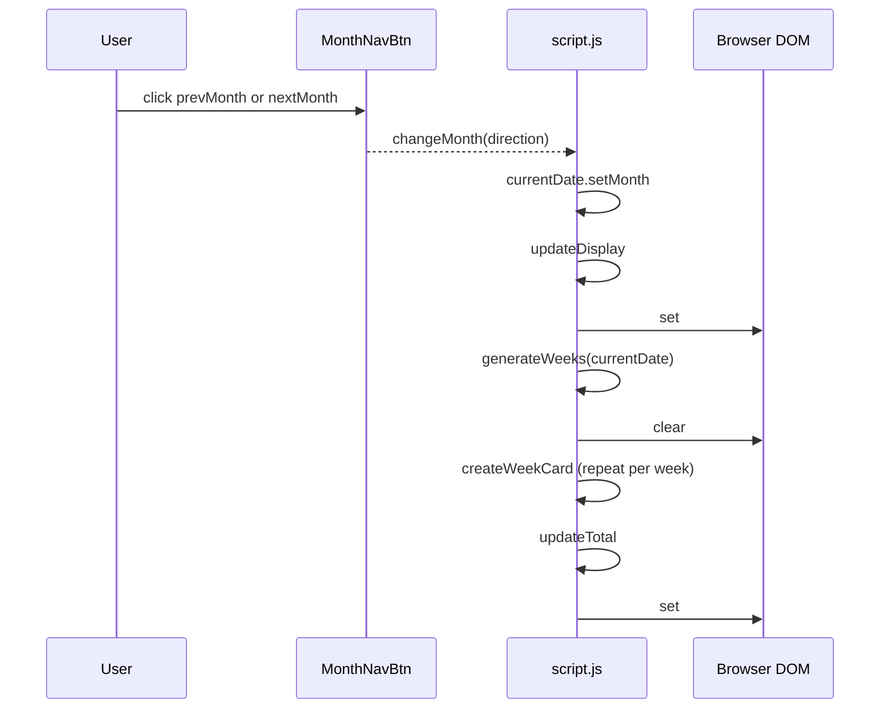

# 2) Time Tracker Web App (UI + Client Logic)

## 2.2 Month Navigation Workflow (changeMonth → updateDisplay → generateWeeks)

### Overview

The month navigation workflow enables users to move forwards and backwards through calendar months, updating the UI to reflect the selected period. When a user clicks the “Previous” or “Next” buttons, the global `currentDate` is mutated, triggering a full refresh of the month badge, week cards, and total days display. This workflow ensures that week ranges are recalculated and any stored data for the newly selected month is loaded or initialized.

### Control Flow

### Key Functions

| Function | Description |
| --- | --- |
| changeMonth(direction) | Adjusts `currentDate` by `direction` (−1 for previous, +1 for next) and calls `updateDisplay()` |
| updateDisplay() | Formats `currentDate` into a month-year string, updates the month badge, invokes `generateWeeks(currentDate)`, then calls `updateTotal()` |
| generateWeeks(date) | Computes weekly ranges for `date`’s month, clears the weeks container, retrieves stored data via `getCurrentMonthData()`, and calls `createWeekCard()` for each week |

### DOM Elements

- **#prevMonth**, **#nextMonth**

Buttons bound to `changeMonth(-1)` and `changeMonth(1)` respectively, for backward and forward navigation

- **#currentMonth**

Displays the localized month and year badge (e.g., “March 2026”)

- **#weeksContainer**

Host element where `generateWeeks` injects or clears `.week-card` elements

### Behavior Details

1. **changeMonth(direction)**

Updates the month on the global `currentDate` object and immediately calls `updateDisplay()` to refresh the UI .

1. **updateDisplay()**- Computes `monthName` via

`currentDate.toLocaleString('default', { month: 'long', year: 'numeric' })`.

- Sets `document.getElementById('currentMonth').textContent = monthName`.
- Calls `generateWeeks(currentDate)` to rebuild week cards.
- Invokes `updateTotal()` to recalculate and animate the total days.

1. **generateWeeks(date)**- Determines `firstDay` and `lastDay` of the month.
- Clears `weeksContainer.innerHTML`.
- Retrieves or initializes month data with `getCurrentMonthData()`.
- Iterates from `firstDay` in seven-day increments, computing `weekStart` and `weekEnd`, clamping `weekEnd` to `lastDay`.
- For each week, calls `createWeekCard(weekNumber, weekStart, weekEnd, monthData)` to append the card.

### Test Expectations

Playwright end-to-end tests ensure that month navigation behaves as intended:

- **Controls Are Visible**

Both `#prevMonth` and `#nextMonth` buttons must be rendered and visible on load .

- **Badge Text Changes**

Clicking either navigation button causes `#currentMonth.textContent` to differ from its previous value .

- **Week Cards Regenerated**

After navigation, the count of `.week-card` elements remains at least 4, confirming `generateWeeks` ran successfully .

- **Data Persistence Across Months**

Days entered in one month reset to 0 upon navigating away and restore to their original values when the user returns .