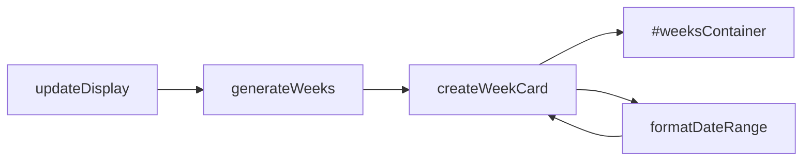
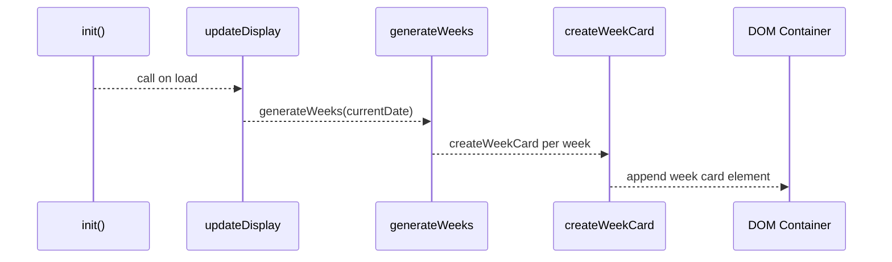

# 2.3 Week Card Generation & Rendering

## Overview

The Time Tracker app breaks a selected month into contiguous seven-day intervals (“weeks”), renders each interval as a card in the UI, and formats its date range label for easy scanning. When the user navigates to a month or on initial load, the client logic:

1. Slices the month into weekly segments—each up to seven days, with the final segment clipped at month end.
2. Formats each segment’s start and end dates using short month names and numeric days.
3. Creates a “week card” DOM element for each interval, populating it with:- A title (“Week 1”, “Week 2”, …)
- The saved days-worked value (or zero)
- A date-range label (“Mar 1 – Mar 7”)
- A number input (`0–7`) and Save button wired to persist edits.

This approach ensures a consistent grid of week cards that update dynamically as the user changes months or enters data.

## Architecture Overview



## Key Functions

### generateWeeks(date)

**Purpose:**

Divide the month of the given `Date` into week‐length intervals, clear any existing cards, then invoke `createWeekCard` for each interval.

```javascript
function generateWeeks(date) {
    const year = date.getFullYear();
    const month = date.getMonth();

    // Get first and last day of month
    const firstDay = new Date(year, month, 1);
    const lastDay  = new Date(year, month + 1, 0);

    const weeksContainer = document.getElementById('weeksContainer');
    weeksContainer.innerHTML = '';

    // Fetch stored values for this month
    const monthData = getCurrentMonthData();

    let currentWeekDate = new Date(firstDay);
    let weekNumber = 1;

    while (currentWeekDate <= lastDay) {
        const weekStart = new Date(currentWeekDate);
        const weekEnd   = new Date(currentWeekDate);
        weekEnd.setDate(weekEnd.getDate() + 6);

        // Clip at month end
        if (weekEnd > lastDay) {
            weekEnd.setTime(lastDay.getTime());
        }

        createWeekCard(weekNumber, weekStart, weekEnd, monthData);

        currentWeekDate.setDate(currentWeekDate.getDate() + 7);
        weekNumber++;
    }
}
```

This loop:

- Initializes at the first day of the month.
- Advances in 7-day steps.
- Ensures the final week does not exceed the month boundary.

---

### formatDateRange(start, end)

**Purpose:**

Produce a human-readable label showing a start–end date range with a short month name and numeric day.

```javascript
function formatDateRange(start, end) {
    const options = { month: 'short', day: 'numeric' };
    return `${start.toLocaleDateString('default', options)} - ${end.toLocaleDateString('default', options)}`;
}
```

- Uses `toLocaleDateString` with `{ month: 'short', day: 'numeric' }` to yield strings like “Mar 1” and “Mar 7”.
- Concatenates with a hyphen.

---

### createWeekCard(weekNum, startDate, endDate, monthData)

**Purpose:**

Construct and insert a week-card element for a given interval, wiring up display values and input controls.

```javascript
function createWeekCard(weekNum, startDate, endDate, monthData) {
    const weeksContainer = document.getElementById('weeksContainer');
    const weekId = `week${weekNum}`;

    const card = document.createElement('div');
    card.className = 'week-card';
    card.innerHTML = `
        <div class="week-header">
            <div class="week-title">Week ${weekNum}</div>
            <div class="week-days" id="${weekId}-display">
                ${monthData[weekId] || 0}
            </div>
        </div>
        <div style="font-size: 0.875rem; color: var(--text-light); margin-bottom: 0.5rem;">
            ${formatDateRange(startDate, endDate)}
        </div>
        <div class="input-group">
            <input 
                type="number" 
                id="${weekId}-input" 
                min="0" 
                max="7" 
                placeholder="Enter days worked"
                value="${monthData[weekId] || ''}"
            >
            <button onclick="saveDays('${weekId}')">Save</button>
        </div>
    `;

    weeksContainer.appendChild(card);
}
```

**Details:**

- **Container:** Appends each card into `#weeksContainer`.
- **Week ID:** Derives `weekId` (e.g., `"week1"`) for consistent element IDs.
- **Saved Values:**- Display area (`div.week-days`) shows `monthData[weekId]` or `0`.
- Input field’s `value` attribute set to `monthData[weekId]` or empty for new entries.
- **Input Attributes:**- `type="number"`, `min="0"`, `max="7"` enforce valid day counts.
- `placeholder="Enter days worked"` guides the user.
- **Save Button:** Inline `onclick="saveDays('weekN')"` persists the new value.

---

## Rendering Flow



---

## Example Markup

A generated Week 1 card might look like:

```html
<div class="week-card">
  <div class="week-header">
    <div class="week-title">Week 1</div>
    <div class="week-days" id="week1-display">0</div>
  </div>
  <div style="font-size: 0.875rem; color: var(--text-light); margin-bottom: 0.5rem;">
    Mar 1 - Mar 7
  </div>
  <div class="input-group">
    <input
      type="number"
      id="week1-input"
      min="0"
      max="7"
      placeholder="Enter days worked"
      value=""
    >
    <button onclick="saveDays('week1')">Save</button>
  </div>
</div>
```

This structure ensures consistent styling, accessibility via unique IDs, and data binding between the display, input, and storage logic.