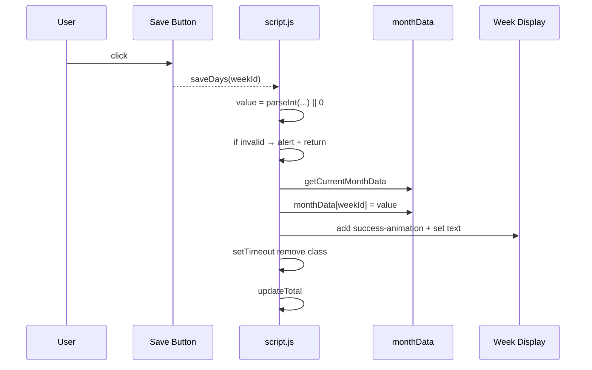
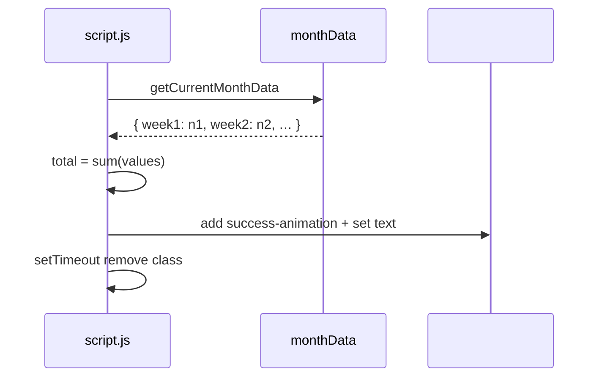

# 2.4 Data Entry, Validation, and Totals Computation

## Overview

This feature enables the user to record the number of days worked for each week of the currently selected month, ensuring inputs remain within a valid 0–7 range, and provides immediate visual feedback through a brief success animation. After each entry, the app recalculates the total days worked for that month, updating both the per-week display and the monthly total counter. Together, these interactions streamline time tracking by combining real-time validation, persistence in the in-memory month data model, and dynamic UI updates.

Data is held in a simple in-memory structure keyed by month (YYYY-MM) and week identifiers (e.g., “week1”), allowing each month to maintain its own state. Client logic functions—**saveDays** and **updateTotal**—coordinate input parsing, validation, data persistence via `getCurrentMonthData()`, animated UI feedback, and aggregate computation.

## Architecture Overview

```mermaid
flowchart TB
    subgraph UI_and_ClientLogic
        U[User clicks Save] -->|onclick| SD[saveDays(weekId)]
        SD --> PI[parseInt(input.value) || 0]
        PI --> V{value < 0 or > 7?}
        V -- Yes --> AL[alert('Please enter a value between 0 and 7 days')]
        V -- No --> MD[getCurrentMonthData()]
        MD --> UP[monthData[weekId] = value]
        UP --> WU[update week display & animate]
        WU --> UT[updateTotal()]
        UT --> TA[sum Object.values(monthData)]
        TA --> TU[update totalDays display & animate]
    end
```

## Component Structure

### Presentation Layer (script.js)

#### saveDays(weekId)

- **Purpose:** Handle the Save button click for a given week card.
- **Behavior:**1. Select the `<input>` (`#${weekId}-input`) and the display `<div>` (`#${weekId}-display`).
2. Parse the user’s entry with `parseInt(input.value) || 0` to coerce empty or invalid text to 0.
3. Validate: if the parsed value is less than 0 or greater than 7, show a browser `alert('Please enter a value between 0 and 7 days')` and abort.
4. Call `getCurrentMonthData()` to retrieve (or initialize) the in-memory object for the active month.
5. Store the value under `monthData[weekId]`.
6. Add the CSS class `success-animation` to the week’s display element, update its text to the saved value, then remove the class after 500 ms.
7. Invoke `updateTotal()` to refresh the monthly total.

#### updateTotal()

- **Purpose:** Recompute and render the sum of days across all weeks in the current month.
- **Behavior:**1. Retrieve the same month-scoped data object via `getCurrentMonthData()`.
2. Sum all saved values with `Object.values(monthData).reduce((sum, days) => sum + days, 0)`.
3. Select the `#totalDays` element, apply `success-animation`, set its textContent to the computed total, then remove the animation class after 500 ms.

### Data Model: monthData Object

- **Structure:** An object mapping week identifiers to integer day counts, e.g.

`{ week1: 5, week2: 3, week3: 0, … }`

- **Access:** Always obtained and initialized via:

```js
  const monthData = getCurrentMonthData();
```

where `getCurrentMonthData()` looks up `timeData.months[YYYY-MM]` and creates it if absent.

## Feature Flows

### Save Days Sequence



### Totals Computation Sequence



## Error Handling

- Inputs outside the 0–7 range trigger a blocking `alert` with the exact message

**"Please enter a value between 0 and 7 days"**, and no data is saved or totals updated.

- Playwright tests listen for this dialog and assert on its message before accepting it.

## Testing Considerations

Key Playwright assertions ensure each behavior:

- **Valid save & display update:** after filling “5” and clicking Save, the week’s display shows “5.”
- **Total recalculation:** entering “3” then “4” in two distinct week cards leads to `#totalDays` = “7.”
- **Invalid input range:** input of “8” triggers the alert dialog; tests attach a `page.on('dialog',…)` handler to assert the message.
- **Zero-day entry:** saving “0” updates display to “0.”
- **Overwrite behavior:** changing a saved week from “3” to “7” updates both the week display and the monthly total accordingly.
- **Success animation:** immediately after Save, the display element has the `.success-animation` class.

## Key Functions Reference

| Function | Responsibility |
| --- | --- |
| saveDays(weekId) | Parse & validate input; persist into monthData; animate week display; invoke total update. |
| updateTotal() | Sum all values in monthData; update and animate the total-days display. |
