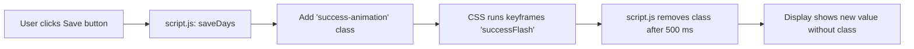

# 2.5 Styling / UX Hooks (styles.css) and Animation Contract

## Overview

The Time Tracker web app relies on a handful of well-defined CSS classes—both structural and behavioral—to drive layout, style, and user feedback. These hooks appear in the static markup (`index.html`), are applied or toggled by the client logic in `script.js`, and are verified by the Playwright end-to-end tests.

By adhering to these class contracts, the app ensures:

- A responsive grid of week cards that remains visible and usable on desktop and mobile viewports.
- Consistent typography and hierarchy for headings and subtitles.
- Immediate visual feedback when a save operation succeeds, via a short animation.

This section documents the required classes, their roles, and the animation contract that styles.css must fulfill.

---

## Class Contract Definitions

### 1. `.subtitle`

Applied to the paragraph under the main header, this class establishes the secondary header typography and spacing for the entire app.

- Markup reference:

`<p class="subtitle">Track your work days this month</p>`

- Tests verify its presence and text content on page load .
- Expected styles:

• Font family “DM Sans” (weight 400)

• Font size approximately 1 rem

• Text color in a muted tone (`--text-light`)

• Margin below the main `<h1>` for visual separation

### 2. `.weeks-grid`

Serves as the container for all dynamically generated week cards. It must present a flexibly wrapping or grid-based layout.

- Markup reference:

`<div class="weeks-grid" id="weeksContainer">…</div>`

- Playwright tests assert visibility in both desktop (1200×800) and mobile (375×667) viewports .
- Expected styles:

• `display: grid;` or `display: flex; flex-wrap: wrap;`

• On wide screens: multiple columns (e.g., `grid-template-columns: repeat(auto-fill, minmax(200px, 1fr));`)

• On narrow screens: a single column or stacked layout

• Consistent gap between cards (`gap: 1rem`)

### 3. `.week-card`

Each card representing a week must carry this class to enable consistent card styling and to allow test selectors to locate them.

- Applied in `script.js` when generating cards:

`card.className = 'week-card';`

- Playwright tests select `.week-card` to verify structure (title, days display, input, button) .
- Expected styles:

• A bordered or elevated container (`border`, `box-shadow`, `border-radius`)

• Padding and margin for internal spacing

• A background color contrasting with the page background

• Flexible width to fit within `.weeks-grid`

### 4. `.success-animation`

A behavioral hook added to numeric display elements to trigger a brief animation upon saving. This class must correspond to a CSS animation of up to 500 ms.

- Toggled in `saveDays` and `updateTotal`:

```js
  display.classList.add('success-animation');
  setTimeout(() => {
    display.classList.remove('success-animation');
  }, 500);
```

- Tests check for presence of this class immediately after saving, before it is removed .
- Expected styles in `styles.css`:

```css
  .success-animation {
    /* Hook into keyframes defined below */
    animation: successFlash 0.5s ease-in-out;
  }

  @keyframes successFlash {
    0%   { background-color: transparent; }
    50%  { background-color: rgba(76, 175, 80, 0.3); /* success green */ }
    100% { background-color: transparent; }
  }
```

• Animation duration must be ≤ 500 ms

• Must visibly highlight the changed element (color, scale, or opacity)

---

## Styling and Animation Expectations

- **Responsive Grid**

Ensure `.weeks-grid` adapts from multiple‐column desktop layouts to single‐column mobile displays without horizontal scrolling.

- **Card Consistency**

Each `.week-card` should render with uniform dimensions and padding so that the grid looks balanced.

- **Feedback Animation**

The `.success-animation` class must tie to a CSS keyframes animation. The visual effect should clearly indicate success (e.g., a brief highlight or pulse), then return to the normal state within 500 ms so subsequent saves can re-trigger it.

---

## UX Feedback Flow



---

## Testing Considerations

- **Subtitle Verification**

The `.subtitle` element must exist and match the expected text on initial load .

- **Responsive Layout**

`.weeks-grid` and its child `.week-card` elements must remain visible and legible across desktop and mobile viewports .

- **Animation Hook**

Immediately after invoking a save, the display element (e.g., `#week1-display`) must include the `success-animation` class. Tests use a regex to assert its presence .

- **Cleanup Timing**

Although tests do not directly verify removal, the timeout in JavaScript (500 ms) plus the 600 ms `waitForTimeout` in tests ensures the animation class is removed before the next action.

---

By respecting these styling and UX hooks, the Time Tracker app will present a consistent, responsive interface with clear feedback on user actions, while satisfying the Playwright test suite’s expectations.